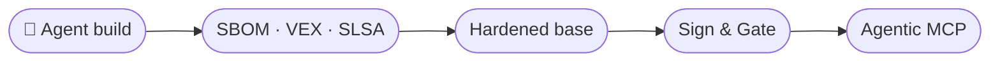
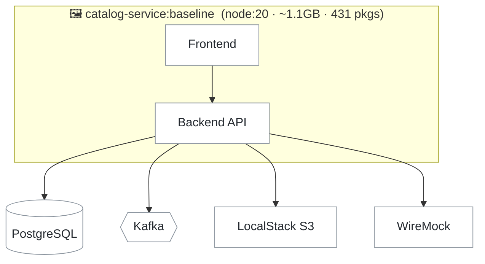

# An Agent Built This



You are going to give an AI agent one instruction and watch it containerise the whole
service - with no mention of base images, versions, security, or best practice.

Here is the stack it has to reason about — a backend API fronted by a UI, talking to
PostgreSQL, Kafka, LocalStack (S3) and WireMock:



## Ask the agent to containerise it

Run this. The agent reads the project, picks a base image on its own, writes a
Dockerfile, resolves the dependency tree, and builds:

```bash terminal-id=main
claude -p "Containerise this Node.js app (frontend, backend, LocalStack, Kafka, WireMock) for production. Add a Dockerfile and build the image as catalog-service:baseline."
```

It succeeded. No errors, no warnings, no questions. Read what it wrote:

```bash terminal-id=main
cat Dockerfile
```

## Freeze here. Three questions.

### What base image did it pick, and who decided that?

Nobody in your organisation chose `node:20`. The agent pattern-matched against whatever
was most common in its training data, which skews toward what was popular a year or two
ago.

### How many packages did that resolve?

```bash terminal-id=build
npm ls --all --parseable 2>/dev/null | wc -l
```

Every one is a package, with a version, with a vulnerability history. You reviewed none
of them. Neither did the agent — resolving a dependency and evaluating it are different
activities, and it only did the first.

### Can you prove where any of it came from?

No. Not the base image, not the packages, not the build itself. That is the subject of
the next eighty minutes.

## Measure it

This image is the baseline every later lab compares against.

1. Get the vulnerability overview:

    ```bash terminal-id=build
    docker scout quickview catalog-service:baseline --org $$org$$
    ```

2. Run the default policy evaluation - watch it fail:

    ```bash terminal-id=build
    docker scout policy catalog-service:baseline --org $$org$$
    ```

3. Note the size:

    ```bash terminal-id=build
    docker images catalog-service:baseline
    ```

**Write these down.** Severity counts, policy pass rate, image size. You fill in the
second row in Lab 2:

| | Critical | High | Medium | Low | Size |
|---|---|---|---|---|---|
| `catalog-service:baseline` | 0 | 8 | 41 | 93 | 1.1GB |
| `catalog-service:dhi` | | | | | |

## Checkpoint

- [ ] You watched the agent choose a base image and build the app
- [ ] You have read the Dockerfile the agent wrote
- [ ] You know how many packages the image contains
- [ ] You have recorded the baseline severity counts and size
- [ ] You have seen the default policy evaluation fail
