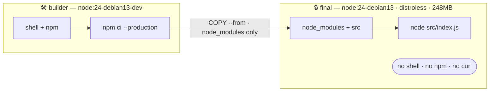

# Lab 2 — Start From a Trusted Base


**16 minutes · hands-on**

The migration in one picture — a builder stage with a shell and npm produces
`node_modules`, and only that output is copied into a distroless runtime:



This is the pivot of the workshop. You spent Lab 1 learning to measure an image. Now you
change one thing about where it starts, and measure it again.

---

## Two variants, and why it matters

Docker Hardened Images come in two flavours, and you need both:

| Variant | Tag | What it has |
|---------|-----|-------------|
| Dev | `$$dhiPrefix$$node:24-debian13-dev` | A shell and npm — for building |
| Runtime | `$$dhiPrefix$$node:24-debian13` | Distroless — no shell, no package manager |

Because the runtime variant has no shell, you cannot run `npm install` in it. That
forces a multi-stage build: the dev image installs dependencies, the runtime image
receives only the output. An image with no shell is one an attacker cannot drop into.

---

## Migrate

1. Replace the Dockerfile with a multi-stage build on hardened bases:

    ```dockerfile save-as=Dockerfile
    ###########################################################
    # Stage: base — DHI dev variant, has shell and npm
    ###########################################################
    FROM $$dhiPrefix$$node:24-debian13-dev AS base

    WORKDIR /usr/local/app
    COPY package.json package-lock.json ./

    ###########################################################
    # Stage: production-dependencies
    ###########################################################
    FROM base AS production-dependencies
    ENV NODE_ENV=production
    RUN npm ci --production --ignore-scripts && npm cache clean --force

    ###########################################################
    # Stage: final — DHI runtime variant, distroless
    ###########################################################
    FROM $$dhiPrefix$$node:24-debian13 AS final
    ENV NODE_ENV=production
    WORKDIR /usr/local/app

    COPY --from=production-dependencies /usr/local/app/node_modules ./node_modules
    COPY ./src ./src

    EXPOSE 3000
    CMD ["node", "src/index.js"]
    ```

2. Build it:

    ```bash terminal-id=build
    docker build -t catalog-service:dhi --sbom=true --provenance=mode=max .
    ```

---

## Confirm it still works

A hardened image that breaks your application is not a security win.

```bash terminal-id=build
docker run --rm catalog-service:dhi node --version
```

Same runtime, same app.

---

## Now measure it

1. The overview:

    ```bash terminal-id=build
    docker scout quickview catalog-service:dhi --org $$org$$
    ```

2. The direct comparison:

    ```bash terminal-id=build
    docker scout compare --to catalog-service:baseline catalog-service:dhi --org $$org$$
    ```

3. The size difference:

    ```bash terminal-id=build
    docker images catalog-service
    ```

4. Fill in your table:

    | | Critical | High | Medium | Low | Size |
    |---|---|---|---|---|---|
    | `catalog-service:baseline` | 0 | 8 | 41 | 93 | 1.1GB |
    | `catalog-service:dhi` | 0 | 0 | 1 | 4 | 248MB |

---

## Where did the CVEs go?

This is the part people misunderstand. They were not patched.

1. Count the packages again and compare with Lab 1:

    ```bash terminal-id=build
    docker scout sbom --format spdx --output dhi.spdx.json catalog-service:dhi
    ```

    ```bash terminal-id=build
    jq '.packages | length' dhi.spdx.json
    ```

2. Try to get a shell:

    ```bash terminal-id=build
    docker run --rm catalog-service:dhi sh -c "echo hello"
    ```

The vulnerable packages are **gone**, not fixed. There is no shell to drop into, no
package manager to install with, and no `curl` to fetch a second stage.

---

## Re-run Lab 1 against the base

Everything you learned now returns a different answer.

```bash terminal-id=build
docker scout attest list $$dhiPrefix$$node:24-debian13
```

An SBOM, a VEX document, SLSA provenance and a signature — all shipped with the base
image, all verifiable, none of which you had to produce. Compare that with the agent's
image, which shipped nothing but itself.

---

## Checkpoint

- [ ] `catalog-service:dhi` builds from the same source
- [ ] The runtime still works
- [ ] You have recorded the severity and size deltas
- [ ] You have confirmed there is no shell in the final image
- [ ] You have listed the attestations that arrived with the base

## What you should be thinking

**The attack surface shrank.** Fewer packages, and no shell means a compromised process
has far less to work with. **The evidence burden moved.** In Lab 1 you generated an SBOM
and had nothing to verify. Starting from a hardened base, all of that arrives with the
image, signed by somebody whose job is keeping it current. You still own your application
layer; you are no longer responsible for proving things about an OS you did not assemble.
