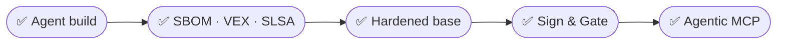

# Conclusion



## What you did to one application

| Stage | The catalog | What you could prove |
|-------|------------|---------------------|
| An agent built it | Whatever base it chose | Nothing |
| Lab 1 | + vocabulary | What is in it, and which findings matter |
| Lab 2 | Hardened base | All three questions, inherited from the base |
| Lab 3 | + cosign, + a gate | That it stays true |
| Lab 4 | + hardened MCP server | The same, for your agent's tools |

Nothing about the application changed. The source is identical. What changed is how much
of it you can account for.

---

## Run the agent again

Same agent. Same prompt. One difference: this time it has rails — a hardened base pinned
in its instructions and the Lab 3 policy gate live in the pipeline. It produces something
that passes on the first attempt.

> [!IMPORTANT]
> This is the point of the entire session.
>
> You did not slow the agent down, take away its autonomy, or add a human review step
> back into the loop. You made the fast path and the safe path the same path.
>
> The agent was never the problem. The absence of verifiable evidence was.

---

## Your security framework

1. **Know what is in your images** — SBOM and VEX
2. **Verify where they came from** — SLSA provenance and signatures
3. **Start from a trusted base** — hardened images
4. **Enforce at the pipeline** — build policies that fail closed
5. **Isolate your agents** — MCP servers in hardened containers

---

## Do this Monday

Pick your highest-volume base image. Swap one non-critical service to the hardened
equivalent, rebuild, and compare. That single measurement will tell you more about your
exposure than a week of reading. Then store the SBOM as a build artifact, and add one
policy gate that fails closed on signature verification.

---

## One last check

```bash terminal-id=build
docker images catalog-service
```

Two images, same source. One you can prove things about.

---

## Resources

| | |
|---|---|
| Docker Hardened Images | <https://docs.docker.com/dhi/> |
| Docker Scout | <https://docs.docker.com/scout/> |
| MCP Catalog | <https://hub.docker.com/mcp> |
| SLSA framework | <https://slsa.dev> |
| OpenVEX | <https://openvex.dev> |
| Sigstore and cosign | <https://docs.sigstore.dev/cosign/> |
| Product Catalog sample | <https://github.com/dockersamples/catalog-service-node> |
